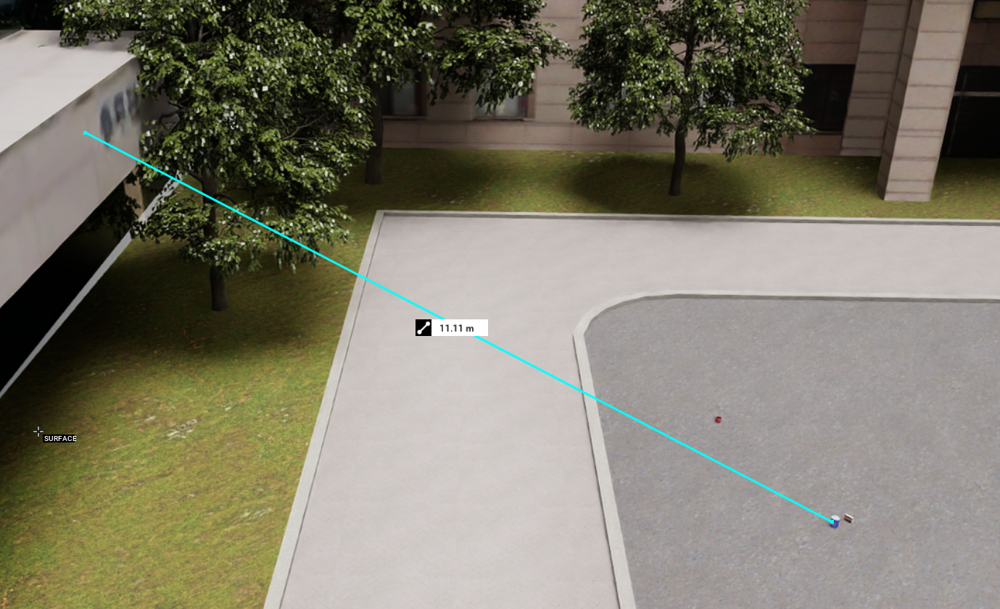
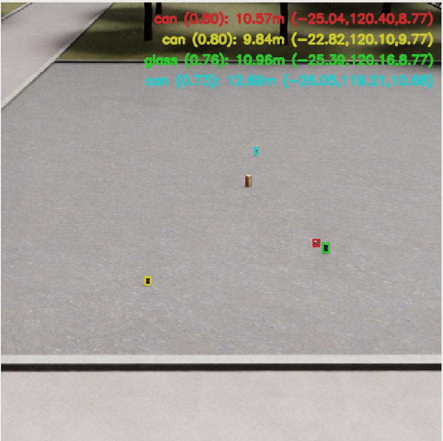

<p align="center">
  <h1 align="center">YOLO_DEPTH_ROS</h1>
</p>
YOLO_DEPTH_ROS is an integrated ROS 2 pipeline that combines state-of-the-art object detection with depth estimation, allowing you to compute the distance of objects using only RGB images. This package is designed to work in real time and is optimized for systems with CUDA support. Whether you are developing robotics applications or building computer vision solutions, this toolkit provides a comprehensive and flexible approach to object detection and distance estimation.


## Local Setup

```bash
conda create -n yolo_depth_ros python=3.10
conda activate yolo_depth_ros
mkdir -p ~/ros2_ws/src
cd ~/ros2_ws/src
git clone https://github.com/7zjatl7/yolo_depth_ros.git
pip install -r requirments.txt
cd ~/ros2_ws
rosdep install --from-paths src --ignore-src -r -y
colcon build --symlink-install
```

> ✅ Tested with **CUDA 12.1** and **Python 3.10**

## Running
Once the workspace is built, you can launch the YOLO_DEPTH_ROS pipeline using the following command:
```bash
ros2 launch yolo_depth_bringup yolo_depth.launch.py \
  det_model:=<path to trained model> \
  dep_model:=<vits | vitb | vitl> \
  dep_model_path:=<path to trained model> \
  input_image_topic:=<input image topic>
```


> ⚠️ Note: Depth values may vary depending on the camera intrinsic parameters. Make sure to adjust the `fx` and `fy` values accordingly.

<details>
  <summary><strong>Options</strong></summary>
  
<br>

- **det_model**: Path to the YOLO detection model (default: `yolov8m.pt`)
- **dep_model**: Depth model type; options: `vits`, `vitb`, `vitl` (default: `vitl`)
- **dep_model_path**: Path to the depth estimation model (default: `depth-anything/Depth-Anything-V2-Small-hf`)
- **device**: Device to run the models on, such as `cuda:0` or `cpu` (default: `cuda:0`)
- **enable**: Enable or disable the nodes (default: `True`)
- **threshold**: Detection confidence threshold (default: `0.5`)
- **iou**: IoU threshold for Non-Maximum Suppression (default: `0.7`)
- **input_image_topic**: Input image topic name (default: `/camera/rgb/image_raw`)
- **imgsz_height**: Input image height (default: `640`)
- **imgsz_width**: Input image width (default: `640`)
- **half**: Use half-precision (FP16) for faster inference (default: `False`)
- **max_depth**: Maximum depth value per image (default: `50`)
- **max_det**: Maximum number of detection boxes per image (default: `300`)
- **augment**: Enable test-time augmentation (TTA) (default: `False`)
- **agnostic_nms**: Enable class-agnostic NMS (default: `False`)
- **image_reliability**: Image QoS reliability: `0` (System Default), `1` (Reliable), `2` (Best Effort) (default: `1`)
- **fx**: Camera focal length in x-axis (default: `1000.0`)
- **fy**: Camera focal length in y-axis (default: `1800.0`)
- **cx**: Camera principal point x-coordinate (default: `319.5`)
- **cy**: Camera principal point y-coordinate (default: `319.5`)
- **namespace**: ROS namespace for all nodes (default: `yolo_depth`)
- **use_tracking**: Whether to activate tracking after detection (default: `True`)
</details>


## Docker
If you prefer using Docker, you can build and run a containerized version of YOLO_DEPTH_ROS. Follow these steps:

```bash
docker build -t yolo_ros .
```

To run the Docker container, make sure you have the **NVIDIA Container Toolkit** installed. Add `--gpus all` if you want to enable GPU support:

```bash
docker run -it --rm --net=host -e DISPLAY=$DISPLAY -v /tmp/.X11-unix:/tmp/.X11-unix yolo_depth_ros:latest
```

## Models
You need two models for `yolo_depth_ros`.  They can be downloaded from the following repositories:

- [Depth Anything](https://github.com/DepthAnything/Depth-Anything-V2)
- [YOLOv12](https://github.com/sunsmarterjie/yolov12)

<!-- 

## Demo
Ground truth distance between objects from the camera in virtual world
<p align="center">
  
</p>

Estimated distance between objects from the camera in virtual world
<p align="center">
  
</p> -->